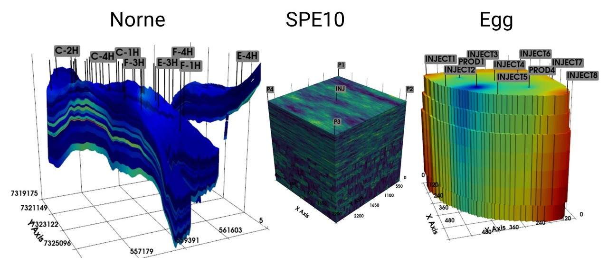

[](https://python.org)


# DeepField

Python framework for reservoir engineering.



## Features

* reservoir representation with Grid, Rock, States, Wells, Faults, Aquifer, and PVT-tables
* interactive 3D visualization
* reservoir preprocessing tools
* detailed [documentation](https://deepfield-team.github.io/DeepField/)
* [tutorials](/tutorials) to explore the framework step-by-step


## Installation

Clone the repository:

    git clone https://github.com/deepfield-team/DeepField.git

Working with a remote server, it is recommended to install
VNC for remote rendering of 3D graphics (follow this [instruction](./vnc/README.md))

Another option is to build the docker image with DeepField inside.
Instructions and dockerfile are provided in the [docker](./docker) directory.

```
Note: the project is in developement. We welcome contributions and collaborations.
```

## Quick start

Load a reservoir model from `.DATA` file (some models are given in the [open_source](./open_source) directory):

```python

  from deepfield import Field

  model = Field('model.data').load()
```

See the [tutorials](./tutorials) to explore the framework step-by-step
and the [documentation](https://deepfield-team.github.io/DeepField/) for more details.


## Model formats

Initial reservoir model can be given in a mixture of ECLIPSE, MORE, PETREL, tNavigator formats.
However, there is no guarantee that any mixture will be understood.
Main file should be in `.DATA` file. Dependencies can be text and binary files including common formats:

* .GRDECL
* .INC
* .RSM
* .UNRST
* .RSSPEC
* .UNSMRY
* .SMSPEC
* .EGRID
* .INIT

See the full list of supported keywords in the [documentation](https://deepfield-team.github.io/DeepField/#supported-keywords).

Within the `DeepField` framework it is recommended to use the HDF5 format
to speed up data load and dump. In this
case all data are contained in a single `.HDF5` file. At any point the model
can be exported back into `.DATA` text and binary files compatibile
with conventional software.
